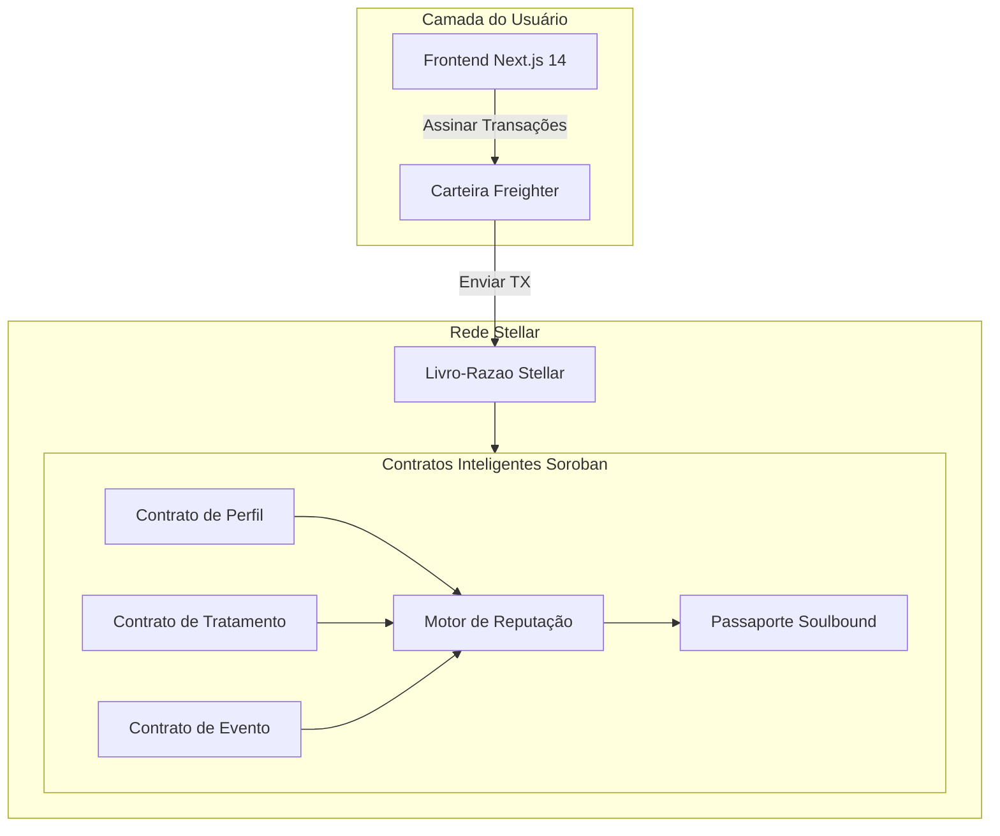

<p align="center">
  
</p>

<h1 align="center">CronoCapilar — Whitepaper</h1>
<h3 align="center">Proof of Care: Um Protocolo de Reputação Descentralizada para Cuidados Capilares Naturais</h3>

<p align="center">
  <strong>Versão 1.0 | Março 2026</strong><br/>
  Angela Salles — <a href="https://ang3la.xyz">Ang3la.xyz</a>
</p>


---

## Indice

1. [Resumo Executivo](#1-resumo-executivo)
2. [Analise de Mercado](#2-analise-de-mercado)
3. [Declaração do Problema](#3-declaração-do-problema)
4. [CronoCapilar: A Solução](#4-cronocapilar-a-solução)
5. [Por que Stellar](#5-por-que-stellar)
6. [Arquitetura do Protocolo](#6-arquitetura-do-protocolo)
7. [Protocolo Proof of Care](#7-protocolo-proof-of-care)
8. [Passaporte Soulbound (SBT)](#8-passaporte-soulbound-sbt)
9. [Motor de Reputação](#9-motor-de-reputação)
10. [Camada Comunitaria e Social](#10-camada-comunitaria-e-social)
11. [Modelo de Receita](#11-modelo-de-receita)
12. [Onboarding: Cuidado Primeiro, Cripto Nunca](#12-onboarding-cuidado-primeiro-cripto-nunca)
13. [Analise Competitiva](#13-analise-competitiva)
14. [Governanca](#14-governanca)
15. [Roadmap](#15-roadmap)
16. [Time](#16-time)
17. [Referencias](#17-referencias)

---

## 1. Resumo Executivo

O mercado global de cuidados capilares ultrapassa US$90 bilhões anualmente, mas a experiencia para consumidores de cabelo natural permanece fragmentada, opaca e movida por fontes pouco confiaveis. Pessoas com cabelo cacheado, crespo e texturizado navegam em um labirinto de produtos, rotinas e conselhos conflitantes — sem como verificar o que realmente funciona, para quem e durante quanto tempo.

CronoCapilar é uma rede social descentralizada construida na [Stellar](https://stellar.org/) que transforma rotinas diarias de cuidado capilar em registros verificaveis on-chain chamados Proof of Care. Cada tratamento, evento e marco e permanentemente registrado na blockchain Stellar, formando um passaporte capilar imutavel que pertence inteiramente ao usuário.

Esse passaporte alimenta um Motor de Reputação que recompensa o autocuidado consistente com autoridade comunitaria — não por especulação ou posse de tokens, mas por ação genuina e sustentada. O resultado é uma camada de confianca que beneficia todos: usuários ganham insights confiaveis de pares, profissionais ganham contexto sobre clientes, e marcas ganham inteligencia de mercado autentica.

O CronoCapilar e gratuito para todos os usuários, sempre. A receita e gerada por um Marketplace curado, relatorios de B2B Intelligence e Ferramentas Profissionais — tres pilares que monetizam a camada de confianca sem jamais cobrar as pessoas que a criam.

---

## 2. Analise de Mercado

### 2.1 A Industria Global de Cuidados Capilares

O mercado de cuidados capilares é um dos maiores segmentos dentro de cuidados pessoais, avaliado em mais de US$90 bilhões globalmente e crescendo de forma consistente ano apos ano. Dentro desse mercado, o segmento de cabelos naturais e texturizados experimenta crescimento acelerado, impulsionado por movimentos culturais que celebram a beleza natural, maior representação na mídia e uma mudança geracional contra o alisamento químico.

Dinamicas-chave do mercado:

- Proliferação de produtos sem orientação. Milhares de novos produtos são lancados anualmente voltados para cabelos cacheados e crespos, mas consumidores não tem um mecanismo confiavel para avalia-los além de alegações de marketing e recomendações de influenciadores.
- Altas taxas de insatisfação. Pesquisa conduzida para o pitch CronoCapilar Ignite revelou que 68% dos consumidores de cabelo natural reportam insatisfação com suas rotinas de cuidado, citando confusão sobre agendamento de tratamentos e seleção de produtos como principais frustrações.
- Desconexao profissional. Profissionais de cuidados capilares — estilistas, tricologistas e donos de salao — operam com dados historicos minimos sobre as rotinas caseiras de seus clientes, levando a recomendações subotimas.

### 2.2 A Persona: Maria

Durante o desenvolvimento, o CronoCapilar identificou uma persona central que representa milhões:

> Maria tem 28 anos e fez transição para cabelo natural há dois anos. Ela segue multiplos influenciadores, já experimentou dezenas de produtos e mantem um calendario mental de tratamentos de Hidratação, Nutrição e Reconstrução. Apesar de seu esforco, ela não sabe se sua rotina esta realmente funcionando. Ela não consegue compartilhar seu historico com um estilista. Ela não confia em avaliações de produtos porque não pode verificar a experiencia real do avaliador. Maria quer clareza, comunidade e prova de que sua dedicação importa.

Maria representa uma audiencia massiva e subatendida: pessoas que se importam profundamente com seus cabelos mas carecem da infraestrutura para cuidar de forma eficaz.

### 2.3 A Lacuna de Confianca

O ecossistema de cuidados capilares naturais sofre de um deficit estrutural de confianca:

```
┌──────────────────────────────────────────────────────┐
│                  A LACUNA DE CONFIANCA                 │
├──────────────┬───────────────┬───────────────────────┤
│   Usuários   │  Profissionais│     Marcas             │
│   ────────   │  ───────────  │     ──────             │
│   Sem hist.  │  Sem contexto │     Sem feedback real  │
│   Sem prova  │  Sem timeline │     Sem dados verif.   │
│   Sem conf.  │  Sem contin.  │     Sem confianca ganha│
└──────────────┴───────────────┴───────────────────────┘

```

Cada participante do ecossistema — usuários, profissionais e marcas — sofre com a ausencia de um registro compartilhado e verificavel de cuidado. O CronoCapilar preenche essa lacuna.

---

## 3. Declaração do Problema

### 3.1 O Ciclo de Frustração

A experiencia de cuidado capilar natural, para a maioria das pessoas, segue um ciclo previsivel e exaustivo:

```
  ┌─────────────────────────────────────────────┐
  │           O CICLO DE FRUSTRACAO              │
  │                                               │
  │    Confusão ──► Produto Errado ──► Falha     │
  │        ▲                              │       │
  │        │                              ▼       │
  │    Sem Registro ◄── Frustração ◄── $ Perdido │
  │                                               │
  └─────────────────────────────────────────────┘

```

1. Confusão — O usuário não sabe se seu cabelo precisa de Hidratação, Nutrição ou Reconstrução naquele momento.
2. Produto errado — Sem dados ou orientação confiavel, seleciona produtos com base em marketing, posts de influenciadores ou tentativa e erro.
3. Falha — O produto não entrega os resultados esperados porque não era o tratamento certo para o estado atual do cabelo.
4. Recursos desperdicados — Tempo e dinheiro são perdidos em produtos que nunca foram adequados.
5. Frustração — O usuário perde confianca em sua capacidade de gerenciar seu proprio cabelo.
6. Sem registro — Nada foi rastreado, nenhuma lição e preservada, é o ciclo recomeca.

### 3.2 Causas Raiz

O ciclo de frustração persiste por quatro falhas sistemicas:

Sem memoria persistente. Rotinas capilares existem apenas na mente do usuário. Não há sistema para registrar tratamentos, acompanhar resultados ao longo do tempo ou identificar padroes.

Sem identidade portatil. Quando um usuário visita um novo profissional, muda de cidade ou busca conselhos online, comeca do zero. Não existe um "curriculo capilar" verificavel que possa apresentar.

Sem infraestrutura de credibilidade. Nas redes sociais, uma pessoa que nunca tocou em um condicionador profundo tem o mesmo alcance de plataforma que alguem com anos de cuidado dedicado. Expertise não é distinguida de performance.

Sem continuidade profissional. Estilistas e tricologistas dependem inteiramente do auto-relato do cliente — que é incompleto, tendencioso e inconsistente. Cada consulta opera em isolamento.

---

## 4. CronoCapilar: A Solução

### 4.1 Visão

CronoCapilar não é um app de rastreamento capilar. E uma rede social descentralizada onde ações de autocuidado criam identidade, reputação e confianca comunitaria — tudo ancorado na blockchain Stellar.

O insight central e simples: se o cuidado e visivel, o cuidado se torna valioso. Quando alguem pode provar — em um livro-razao imutavel — que consistentemente cuidou de seu cabelo por meses ou anos, essa prova se transforma em autoridade. Autoridade cria confianca. Confianca cria comunidade. Comunidade cria valor.

### 4.2 Experiencia Central

A jornada do usuário segue uma progressão natural:

```
  Entrar no App ──► Criar Perfil Capilar ──► Check-in Diario (H/N/R)
                                                         │
                                                         ▼
                                               Registrar Eventos
                                             (Big Chop, cortes, cor)
                                                         │
                                                         ▼
                                             Construir Proof of Care
                                                         │
                                                         ▼
                                             Ganhar Reputação & Badges
                                                         │
                                                         ▼
                                             Engajar Comunidade
                                         (validar, compartilhar, mentorar)

```

1. Acesse o CronoCapilar com sua conta (nos bastidores, o app cria/conecta uma carteira Stellar compativel, ex.: [Freighter](https://www.freighter.app/))
2. Crie um perfil capilar on-chain (tipo, comprimento, textura, objetivos)
3. Faça check-in diario com tratamentos: Hidratação (H), Nutrição (N) ou Reconstrução (R)
4. Registre eventos — Big Chop, cortes, coloração, tratamentos de proteina e outros marcos
5. Construa uma timeline de Proof of Care — um registro imutavel de toda a jornada capilar
6. Ganhe reputação, badges e evolução do Passaporte Soulbound por cuidado sustentado
7. Engaje a comunidade — valide pares, compartilhe insights e construa conhecimento coletivo

### 4.3 O Que Torna Diferente

CronoCapilar não esta competindo com apps de cuidado capilar. Esta construindo algo que ainda não existe: uma infraestrutura de confianca para cuidados capilares.

| Apps Tradicionais | CronoCapilar |
| --- | --- |
| Dados em servidores da empresa | Dados na blockchain Stellar |
| Plataforma dona dos dados | Usuário dono dos seus dados |
| Reputação = seguidores | Reputação = ações de cuidado verificadas |
| Recomendações por algoritmo | Recomendações por autoridade comunitaria |
| Sem portabilidade | Passaporte Soulbound portatil |
| Profissionais excluidos | Profissionais integrados |

---

## 5. Por que Stellar

### 5.1 Alinhamento Filosofico

A Stellar foi criada com a missão de inclusão financeira — conectando populações desbancarizadas e subatendidas do mundo a economia global. O CronoCapilar compartilha esse DNA: cuidados capilares naturais afetam desproporcionalmente comunidades que foram historicamente marginalizadas tanto na beleza quanto nas financas. Construir na Stellar significa construir sobre uma fundação projetada para as pessoas que o CronoCapilar atende.

### 5.2 Comparativo Tecnico

| Criterio | Stellar / Soroban | Ethereum / EVM | Solana |
| --- | --- | --- | --- |
| Custo de transação | < $0,01 | $1–50+ (variavel) | < $0,01 |
| Finalidade | 3–5 segundos | ~15 segundos (L1) | ~400ms |
| TPS | 1.000+ | ~15 (L1) | ~4.000 |
| Contratos inteligentes | Soroban (Rust/WASM) | Solidity (EVM) | Rust (BPF) |
| Anchors & bridges | Nativo (padroes SEP) | Bridges de terceiros | Bridges de terceiros |
| Foco em identidade | Nativo (contas, data entries) | Externo (ENS, etc.) | Externo |
| Alinhamento de missão | Inclusão financeira | Proposito geral | DeFi de alta performance |

### 5.3 Capacidades Stellar Utilizadas

- Contratos Inteligentes Soroban — Toda logica do protocolo (perfis, tratamentos, reputação, passaportes) roda como contratos Soroban escritos em Rust, compilados para WASM.
- Contas Stellar & Manage Data — Perfis de usuários aproveitam as entradas de dados nativos de contas Stellar para armazenamento leve de identidade.
- Padroes SEP — Integração futura com o ecossistema de Anchors da Stellar habilita rampas de entrada/saida fiat para funcionalidade de marketplace.
- Carteira Stellar (ex.: Freighter) — Usada em segundo plano nas operações on-chain; o usuário faz login no app, não na carteira.

---

## 6. Arquitetura do Protocolo

### 6.1 Visão Geral da Arquitetura



### 6.2 Camada On-chain (Contratos Soroban)

Cinco contratos inteligentes Soroban formam o nucleo on-chain do protocolo:

#### Contrato de Perfil

Armazena a identidade de cuidado capilar do usuário:

- Tipo de cabelo (liso, ondulado, cacheado, crespo — usando escala numerica)
- Categoria de comprimento
- Textura e porosidade do cabelo
- Timestamp de criação do perfil
- Proprietario (chave publica Stellar)

#### Contrato de Tratamento

Registra cada ação diaria de cuidado:

- Tipo de tratamento: Hidratação (H), Nutrição (N) ou Reconstrução (R)
- Timestamp do registro
- Hash da transação (para verificação)
- Hash de notas opcional (preservando privacidade)
- Referencia do proprietario

#### Contrato de Evento

Captura marcos significativos da jornada capilar:

- Tipo de evento (Big Chop, corte, coloração, tratamento de proteina, marco de transição)
- Timestamp
- Hash de descrição opcional
- Referencia do proprietario

#### Contrato Motor de Reputação

Calcula e mantem o score de reputação dinamico:

- Agrega frequencia de tratamentos, dados de sequencias, metricas de diversidade e sinais de validação
- Aplica algoritmos de ponderação temporal e decaimento
- Emite limiares de nivel de reputação (Bloom, Rise, Crown, Elder)
- Expoe funções somente-leitura para ranqueamento do feed comunitario

#### Contrato Passaporte Soulbound

Gerencia o token de identidade intransferivel:

- Cunha o passaporte apos o primeiro registro de tratamento
- Atualiza o nivel do badge com base na saida do Motor de Reputação
- Armazena metadados do badge (nivel, variante visual, marcos de conquista)
- Aplica intransferibilidade (restrição soulbound)

### 6.3 Camada Off-chain

- Next.js 14 (App Router) — Frontend React renderizado no servidor com TypeScript, fornecendo uma interface de usuário rapida e acessivel.
- Integração com carteira Stellar (ex.: Freighter) — Assinatura de transações e gerenciamento de contas em segundo plano; o app cuida da criação/vinculo da carteira para o usuário apenas entrar.
- @tanstack/react-query — Gerenciamento de estado e cache do lado do cliente para consultas de dados on-chain.
- Sistema i18n Personalizado — Internacionalização baseada em contexto suportando Ingles, Portugues (Brasil) e Espanhol.

### 6.4 Fluxo de Dados

```
Ação do Usuário (check-in)
       │
       ▼
Frontend Next.js constroi transação
       │
       ▼
Freighter assina transação
       │
       ▼
Transação submetida a rede Stellar
       │
       ▼
Contrato Soroban de Tratamento executa
       │
       ├──► Tratamento armazenado no ledger
       │
       └──► Motor de Reputação recalcula score
                    │
                    └──► Passaporte Soulbound atualiza (se limiar de nivel cruzado)

```

---

## 7. Protocolo Proof of Care

### 7.1 Definição

Proof of Care (PoC) é um mecanismo de reputação não-financeiro e não-especulativo que quantifica atos consistentes de autocuidado verificados on-chain. E a primitiva fundamental da rede CronoCapilar.

Diferente de mecanismos de consenso que protegem blockchains (Proof of Work, Proof of Stake), o Proof of Care protege a confianca social dentro de uma comunidade de dominio especifico. Ele responde uma pergunta: "Essa pessoa cuidou consistentemente de seu cabelo, e isso pode ser verificado?"

### 7.2 O Que Gera Proof of Care

| Ação | Sinal PoC |
| --- | --- |
| Check-in diario de tratamento (H/N/R) | Contribuição base por registro |
| Manter uma sequencia (dias consecutivos) | Multiplicador crescente com duração da sequencia |
| Diversidade de tratamentos balanceada (H + N + R) | Bonus por rotinas equilibradas |
| Registrar um evento significativo | Contribuição de marco |
| Receber validação de pares | Peso amplificado por endossantes reputados |
| Mentorar ou guiar novos usuários | Sinal de contribuição comunitaria |

### 7.3 Propriedades

Intransferivel. Proof of Care esta vinculado a conta Stellar do usuário. Não pode ser comprado, vendido, presenteado ou delegado. Isso previne mercados de reputação e garante autenticidade.

Ponderado pelo tempo. Atividade de cuidado recente tem peso maior que atividade historica. Um usuário que era ativo há um ano mas parou desde então vera seu PoC efetivo diminuir gradualmente, refletindo seu estado atual em vez de conquistas passadas.

Com decaimento. Inatividade prolongada aciona uma função de decaimento que reduz a reputação ao longo do tempo. O decaimento é gradual e não punitivo — simplesmente garante que posições de autoridade sejam ocupadas por participantes atualmente ativos. Usuários que retornam podem reconstruir sua reputação retomando o cuidado consistente.

Componivel. Proof of Care é uma primitiva que alimenta multiplos sistemas: o Motor de Reputação, o Passaporte Soulbound, o ranqueamento do feed comunitario, a visibilidade de produtos no marketplace e a verificação profissional. Cada sistema lê dados de PoC mas os interpreta por sua propria lente.

### 7.4 Formula Conceitual de Reputação

O score de reputação é uma função de multiplas dimensoes:

```
Reputação = f(
    frequencia_de_tratamentos,
    continuidade_de_sequencia,
    diversidade_de_tratamentos,
    validacoes_de_pares,
    marcos_de_eventos,
    fator_de_decaimento_temporal
)

```

Cada dimensão contribui para o score geral por uma agregação ponderada. Os pesos e curvas especificos são projetados para:

- Recompensar consistencia sobre volume (pequenas ações diarias > picos ocasionais)
- Recompensar diversidade sobre repetição (H/N/R balanceado > apenas Hidratação)
- Recompensar engajamento social sobre isolamento (cuidado validado > registro solo)
- Penalizar inatividade gradualmente, não abruptamente

A parametrização exata será refinada por feedback comunitario e governanca conforme o protocolo amadurece.

---

## 8. Passaporte Soulbound (SBT)

### 8.1 Conceito

O Passaporte Soulbound é um token intransferivel (Soulbound Token / SBT) cunhado na Stellar via Soroban. Ele representa a identidade acumulada de cuidado capilar do usuário e evolui visualmente conforme o usuário progride em sua jornada.

O termo "soulbound" reflete a restrição central do token: esta permanentemente vinculado a conta do usuário e não pode ser transferido, vendido ou duplicado. Isso torna o passaporte uma credencial genuina — sua presenca em uma carteira significa que o proprietario o conquistou por ação real.

### 8.2 Niveis de Badges

O passaporte evolui por quatro niveis, cada um representando um grau mais profundo de comprometimento:

| Nivel | Nome | Significado | Identidade Visual |
| --- | --- | --- | --- |
| 1 | Bloom | Despertar — O usuário comecou sua jornada de cuidados e demonstrou consistencia inicial | Motivo de flor brotando, tons quentes suaves |
| 2 | Rise | Crescimento — Sequencias sustentadas, tratamentos diversificados e engajamento comunitario inicial | Motivo de sol nascente, tons medios vibrantes |
| 3 | Crown | Autoridade — Consistencia profunda, validação por pares e expertise reconhecida | Motivo de coroa, tons de joias ricos |
| 4 | Elder | Legado — Dedicação de longo prazo, mentoria e impacto comunitario duradouro | Motivo de arvore ancestral, tons terrosos profundos |

### 8.3 Especificação Tecnica

- Padrao de token: Token customizado Soroban com restrição de transferencia (soulbound)
- Armazenamento de metadados: Nivel de badge on-chain, marcos de conquista e identificador de variante visual; arte off-chain armazenada em IPFS
- Gatilho de evolução: Motor de Reputação emite eventos quando limiares de nivel são cruzados; contrato do Passaporte escuta e atualiza
- Privacidade: O passaporte exibe nivel e badge publicamente; historico detalhado de tratamentos so e visivel com consentimento do usuário
- Portabilidade: Como o passaporte vive na Stellar, e acessivel de qualquer carteira ou dApp compativel — usuários nunca ficam presos ao frontend do CronoCapilar

### 8.4 Casos de Uso

- Credibilidade comunitaria — O nivel do badge e visivel no feed social, sinalizando o nivel de dedicação do usuário
- Consultas profissionais — Um usuário apresenta seu Passaporte a um estilista, fornecendo contexto de historico de cuidado verificado
- Confianca no marketplace — Avaliações de produtos de usuários Crown e Elder carregam mais peso nos rankings
- Identidade cross-platform — O Passaporte pode ser reconhecido por outras aplicações baseadas em Stellar, habilitando reputação interoperavel

---

## 9. Motor de Reputação

### 9.1 Visão Geral

O Motor de Reputação é um contrato inteligente Soroban que agrega sinais de Proof of Care em um unico score de reputação dinamico por usuário. Esse score determina visibilidade no feed comunitario, autoridade na validação de pares e influencia nos rankings do marketplace.

### 9.2 Sinais de Entrada

O motor processa as seguintes entradas para cada usuário:

| Sinal | Fonte | Descrição |
| --- | --- | --- |
| Contagem de tratamentos | Contrato de Tratamento | Total de tratamentos registrados |
| Sequencia ativa | Contrato de Tratamento | Comprimento da sequencia atual de dias consecutivos |
| Maior sequencia | Contrato de Tratamento | Melhor sequencia historica |
| Mix de tratamentos | Contrato de Tratamento | Proporção de distribuição H:N:R |
| Contagem de eventos | Contrato de Evento | Numero de eventos marco registrados |
| Validações recebidas | Camada Comunitaria | Numero de endossos de pares de outros usuários |
| Reputação do validador | Camada Comunitaria | Reputação media dos usuários endossantes |
| Idade da conta | Contrato de Perfil | Tempo desde a criação do perfil |
| Ultima atividade | Contrato de Tratamento | Timestamp do check-in mais recente |

### 9.3 Dinamicas do Score

O score de reputação exibe os seguintes comportamentos:

Acumulação. Cada ação qualificante aumenta o score bruto. A taxa de acumulação e projetada para que usuários diarios dedicados alcancem o nivel Bloom em semanas, Rise em meses e Crown apos atividade sustentada de longo prazo. Elder e reservado para contribuidores excepcionais de multiplos anos.

Resistencia a plato. A formula de pontuação inclui retornos decrescentes em altos volumes para prevenir gaming por registros rapidos em massa. Qualidade e consistencia são favorecidas sobre quantidade bruta.

Decaimento. Quando um usuário para de registrar tratamentos, seu score comeca a decair apos um periodo de graca. O decaimento segue uma curva gradual — nunca subita ou punitiva — garantindo que pausas temporarias (ferias, doenca) não destruam meses de reputação conquistada. Ausencia prolongada, no entanto, reduzira significativamente o score, refletindo o principio de que autoridade deve pertencer a participantes ativos.

Recuperação. Usuários que retornam apos um periodo de inatividade podem reconstruir sua reputação retomando cuidado consistente. A recuperação segue as mesmas regras de acumulação do crescimento inicial, significando que o caminho de volta a um nivel anterior requer re-engajamento genuino.

### 9.4 Medidas Anti-Gaming

- Limitação de taxa: Maximo de um check-in de tratamento por dia previne registros spam
- Verificação de sequencia: Sequencias requerem continuidade diaria, não submissoes em lote
- Limites de reciprocidade de validação: Usuários não podem validar a mesma pessoa repetidamente para efeito amplificado
- Resistencia a Sybil: Intransferibilidade do Passaporte e niveis progressivos de badges tornam ataques multi-conta economicamente irracionais (cada conta deve individualmente conquistar reputação por ação sustentada)

---

## 10. Camada Comunitaria e Social

### 10.1 Feed Baseado em Autoridade

Diferente de redes sociais tradicionais onde a visibilidade do conteudo e movida por metricas de engajamento (curtidas, compartilhamentos, amplificação algoritmica), o feed comunitario do CronoCapilar ranqueia conteudo pela reputação Proof of Care do autor.

Isso significa:

- Posts de usuários Crown e Elder aparecem com mais destaque — não porque são populares, mas porque demonstraram expertise sustentada em cuidado
- Novos usuários (Bloom) ainda podem postar e participar, mas sua visibilidade cresce conforme sua reputação cresce
- O algoritmo e transparente e deterministico: score de reputação mapeia diretamente para peso de posição no feed

### 10.2 Validação de Pares

Usuários podem validar entradas de tratamento ou experiencias compartilhadas de outro usuário. Validação é um ato deliberado — requer revisar o conteudo e submeter um endosso on-chain. Validações carregam peso proporcional a reputação do proprio validador:

- Um endosso de um usuário Crown contribui mais para a reputação do destinatario do que um de um usuário Bloom
- Isso cria um incentivo de mentoria: usuários experientes são recompensados por curar conteudo de qualidade
- Validação e limitada por par de usuários por periodo para prevenir conluio

### 10.3 Verificação Profissional

Profissionais de cuidados capilares (estilistas, tricologistas, donos de salao) podem solicitar verificação profissional. Profissionais verificados recebem:

- Um indicador visual distinto em seu perfil e posts
- Acesso a timelines de cuidado de clientes (com consentimento explicito do cliente)
- Visibilidade aprimorada no marketplace e recomendações
- A capacidade de fornecer validações profissionais, que carregam peso premium no Motor de Reputação

### 10.4 Desafios Comunitarios

Desafios periodicos para toda a comunidade (ex.: "desafio de hidratação 30 dias," "semana de rotina balanceada") criam experiencias compartilhadas que impulsionam engajamento e introduzem novos usuários a habitos de cuidado consistente. A conclusão de desafios contribui para Proof of Care e pode desbloquear variantes visuais especiais do Passaporte.

---

## 11. Modelo de Receita

O CronoCapilar e e sempre será 100% gratuito para usuários finais. A plataforma nunca cobra usuários por criar perfis, registrar tratamentos, construir reputação ou participar da comunidade.

A receita e gerada por tres pilares que monetizam a infraestrutura de confianca criada pelo Proof of Care:

### 11.1 Marketplace

Um marketplace de produtos curado integrado a rede CronoCapilar onde marcas de cuidados capilares e vendedores independentes podem listar produtos. O marketplace se diferencia pela integração com Proof of Care:

- Receita baseada em comissão: Vendedores pagam uma comissão em cada venda completada pelo marketplace. O CronoCapilar não cobra taxas de listagem.
- Avaliações ranqueadas por PoC: Avaliações de produtos são ponderadas pela reputação Proof of Care do avaliador. A avaliação de um usuário Crown carrega demonstravelmente mais autoridade que uma avaliação anonima, criando diferenciação genuina de produto.
- Scores de confianca de marca: Marcas cujos produtos são consistentemente usados por usuários de alta reputação ganham visibilidade por dados organicos e verificados — não por posicionamento pago.
- Curadoria comunitaria: Produtos em alta entre usuários verificados emergem naturalmente, reduzindo a necessidade de publicidade tradicional.

### 11.2 B2B Intelligence

Insights agregados e anonimizados derivados de dados publicos on-chain são empacotados em produtos de inteligencia para marcas de cuidados capilares, fabricantes de produtos e pesquisadores de mercado:

- Relatorios de tendencias de tratamento: Quais tratamentos estão em alta em quais regioes, demografias e tipos de cabelo
- Analise de sentimento de produtos: Como produtos se correlacionam com engajamento sustentado do usuário e resultados positivos de cuidado
- Padroes sazonais: Como rotinas de cuidado mudam entre estações, climas e eventos culturais
- Segmentação de mercado: Insights baseados em dados sobre segmentos subatendidos e necessidades emergentes

Toda inteligencia e derivada de dados publicos disponiveis on-chain e agregada anonimamente. Dados individuais de usuários nunca são vendidos ou expostos. Marcas assinam niveis de inteligencia para acesso.

### 11.3 Pro Tools

Um servico de assinatura para profissionais de cuidados capilares oferecendo funcionalidades premium:

- Acesso a timeline do cliente: Visualize o historico de Proof of Care de um cliente (com seu consentimento explicito baseado em carteira) antes e durante consultas
- Contexto de consulta: Entenda quais tratamentos um cliente tem feito em casa, possibilitando cuidado em salao mais direcionado
- Construção de reputação profissional: Profissionais verificados constroem seu proprio Proof of Care por resultados com clientes e contribuições comunitarias
- Rede de referencia: Conecte-se com clientes buscando cuidado profissional pela rede CronoCapilar, ranqueados por reputação profissional

---

## 12. Onboarding: Cuidado Primeiro, Cripto Nunca

### 12.1 O Desafio da Adoção Web3

A maior barreira para adoção Web3 não é tecnologia — é linguagem. Termos como "blockchain," "carteira," "assinatura de transação" e "taxas de gas" alienam exatamente as comunidades que mais se beneficiariam de sistemas descentralizados. O CronoCapilar aborda isso por uma filosofia deliberada de onboarding: Cuidado Primeiro, Cripto Nunca.

### 12.2 Estrategia

O usuário nunca precisa dizer "blockchain." O fluxo de onboarding foca inteiramente em cuidado capilar:

1. "Crie seu perfil capilar" (não "cunhe um NFT")
2. "Registre seu tratamento" (não "submeta uma transação")
3. "Construa seu passaporte capilar" (não "acumule tokens soulbound")
4. "Faça login no CronoCapilar" (em segundo plano, conectamos uma carteira Stellar para você)

Nenhum login em carteira. O usuário entra no app como em qualquer outro servico. A carteira Stellar (ex.: Freighter) é criada ou vinculada nos bastidores; o usuário não precisa pensar em "conectar carteira" ou "gerenciar chaves", a menos que queira.

Custos são invisiveis. As taxas quase-zero da Stellar significam que o usuário nunca encontra um dialogo de "taxa de gas". A experiencia de registrar um tratamento parece identica a apertar um botao em um app tradicional.

Blockchain é um detalhe de implementação. Os beneficios — imutabilidade, portabilidade, propriedade do usuário — são comunicados em termos de confianca e permanencia, não de tecnologia. "Seus dados pertencem a você" é mais significativo que "seus dados estão em um ledger descentralizado."

### 12.3 Revelação Progressiva

Para usuários curiosos sobre a tecnologia, o CronoCapilar oferece conteudo educacional opcional:

- Explicações in-app de por que dados são armazenados na Stellar
- Links para registros de transação em exploradores Stellar
- Guias para funcionalidades avancadas (incluindo exportação opcional da carteira)
- Discussoes comunitarias sobre descentralização e propriedade de dados

Isso garante que usuários tecnicamente curiosos possam aprofundar sem forcar complexidade tecnica sobre todos.

---

## 13. Analise Competitiva

### 13.1 vs. Apps Tradicionais de Cuidado Capilar

Varios apps existem para rastrear rotinas de cuidado capilar (agendamento de tratamentos, logs de produtos, etc.). Esses apps compartilham limitações comuns:

| Dimensão | Apps Tradicionais | CronoCapilar |
| --- | --- | --- |
| Propriedade de dados | Servidores controlados pela empresa | Controlado pelo usuário (blockchain Stellar) |
| Portabilidade | Preso a plataforma | Portatil via Passaporte Soulbound |
| Reputação | Nenhuma ou baseada em seguidores | Proof of Care (ações verificadas) |
| Mecanismo de confianca | Avaliações por estrelas | Reputação verificada on-chain |
| Integração profissional | Nenhuma | Nativa (Pro Tools) |
| Fonte de receita | Anuncios, tiers premium, venda de dados | Marketplace, B2B Intelligence, Pro Tools |
| Custo para usuário | Tier gratis + funcionalidades pagas | 100% gratuito, sempre |

### 13.2 vs. Conselhos Movidos por Influenciadores

Influenciadores de redes sociais dominam recomendações de cuidado capilar. Os problemas são bem documentados:

- Endossos pagos são frequentemente não divulgados ou mal divulgados
- Sem verificação do historico real de cuidado capilar ou expertise do influenciador
- Amplificação algoritmica recompensa engajamento, não precisão
- Sem responsabilização por recomendações ruins

O CronoCapilar inverte esse modelo: visibilidade e conquistada por ações de cuidado verificadas. Um usuário que manteve uma sequencia de 200 dias de cuidado e recebeu endossos de outros usuários verificados tem mais autoridade que alguem com grande contagem de seguidores mas sem historico de cuidado verificavel.

### 13.3 vs. Outras Redes Sociais Web3

Varias redes sociais Web3 foram lancadas (Lens Protocol, Farcaster, etc.), mas nenhuma e especifica de dominio para cuidados capilares ou bem-estar pessoal. A diferenciação do CronoCapilar:

- Reputação especifica de dominio. Proof of Care e significativo apenas no contexto de cuidado capilar. Esse foco cria um moat que redes de proposito geral não podem replicar.
- Não-especulativo. CronoCapilar não tem token de governanca, staking ou yield farming. Reputação e conquistada pelo cuidado, não pelo capital.
- Onboarding inclusivo. A abordagem "Cuidado Primeiro, Cripto Nunca" e projetada para comunidades tipicamente excluidas da Web3, não para audiencias cripto-nativas.
- Construido na Stellar, não EVM. Custos menores, finalidade mais rapida e alinhamento com valores de inclusão financeira distinguem o CronoCapilar de protocolos sociais baseados em EVM.

---

## 14. Governanca

### 14.1 Estado Atual

O CronoCapilar lanca com governanca centralizada. Parametros do protocolo, desenvolvimento de funcionalidades e politicas comunitarias são gerenciados pelo time central. Isso e deliberado: protocolos em estagio inicial se beneficiam de tomada de decisão focada e responsiva.

### 14.2 Visão Futura

Conforme a comunidade amadurece é o Motor de Reputação estabelece uma camada de confianca confiavel, o CronoCapilar descentralizara progressivamente a governanca:

- Votação ponderada por reputação. Decisoes do protocolo (mudancas de parametros, prioridades de funcionalidades, politicas do marketplace) serão decididas por voto comunitario, onde o poder de voto e proporcional a reputação Proof of Care — não posse de tokens.
- Formação de conselhos. Usuários de nivel Elder poderão formar conselhos consultivos que propoem e revisam mudancas no protocolo antes do voto comunitario.
- Representação profissional. Profissionais verificados terao canais de governanca dedicados para garantir que o protocolo atenda necessidades tanto de consumidores quanto de profissionais.
- Processos transparentes. Todas as propostas de governanca, discussoes e votos serão registrados on-chain para total transparencia.

O modelo de governanca e intencionalmente baseado em reputação em vez de tokens. Isso garante que as pessoas que demonstraram o cuidado mais consistente — as pessoas mais investidas na missão do protocolo — detenham a maior influencia sobre sua direção.

---

## 15. Roadmap

### Fase 1 — Fundação

Fase atual

- Aplicação central: Next.js 14 + TypeScript + integração Stellar
- Acesso por conta (carteira Stellar em segundo plano, ex.: Freighter)
- Criação de perfil capilar on-chain
- Check-in diario de tratamento (H/N/R) com rastreamento de sequencias
- Timeline visual da jornada capilar
- Registro de eventos (Big Chop, cortes, coloração)
- Internacionalização completa (Ingles, Portugues, Espanhol)
- Design responsivo (mobile, tablet, desktop)
- Deploy na Stellar Testnet

### Fase 2 — Protocolo

- Deploy de contratos inteligentes Soroban (Perfil, Tratamento, Evento, MotorDeReputação, PassaporteSoulbound)
- Motor de Proof of Care com pontuação de reputação on-chain
- Cunhagem de Passaporte Soulbound com niveis de badges (Bloom, Rise, Crown, Elder)
- Verificação de sequencias on-chain
- Deploy na Stellar Mainnet
- Auditorias de seguranca

### Fase 3 — Comunidade

- Feed social ranqueado por reputação Proof of Care
- Sistema de validação de pares
- Processo de verificação profissional
- Desafios comunitarios
- Funcionalidades de mentoria
- Diagnostico capilar por IA (analise baseada em fotos)
- Motor de recomendação de produtos (community-driven)

### Fase 4 — Economia

- Lancamento do Marketplace com avaliações ranqueadas por PoC
- Plataforma de B2B Intelligence
- Assinatura Pro Tools para profissionais
- Integração de Anchors para rampas de entrada/saida fiat
- Design de framework de governanca e mecanismos de votação iniciais
- Parcerias cross-platform e acesso a API

---

## 16. Time

Angela Salles — Fundadora & Builder
[Ang3la.xyz](https://ang3la.xyz/)

Angela é a criadora e forca motriz por tras do CronoCapilar. Com profunda experiencia pessoal na jornada de cuidado capilar natural e paixao por tecnologia descentralizada, ela concebeu o CronoCapilar como a interseção de dois mundos: o poder cultural das comunidades de cuidado capilar e a infraestrutura de confiança da blockchain. Angela lidera visão de produto, design de protocolo e desenvolvimento comunitario.

---

## 17. Referencias

1. Stellar Development Foundation. Stellar Documentation. [https://developers.stellar.org](https://developers.stellar.org/)
2. Soroban Smart Contracts. Soroban Documentation. [https://soroban.stellar.org](https://soroban.stellar.org/)
3. Weyl, E. G., Ohlhaver, P., & Buterin, V. (2022). Decentralized Society: Finding Web3's Soul. SSRN.
4. Relatorio do Mercado Global de Cuidados Capilares. Dados de pesquisa de mercado referenciando a industria global de cuidados capilares de US$90B+.
5. CronoCapilar Ignite Pitch. Dados de pesquisa interna: desenvolvimento de persona, pesquisa de insatisfação (metrica de 68%), analise de oportunidade de mercado.
6. Freighter Wallet. Stellar Wallet for the Web. [https://www.freighter.app](https://www.freighter.app/)
7. Padroes SEP (Stellar Ecosystem Proposals). [https://github.com/stellar/stellar-protocol/tree/master/ecosystem](https://github.com/stellar/stellar-protocol/tree/master/ecosystem)

---

Feito com cuidado na [Stellar](https://stellar.org/)

[Leia o Litepaper](https://www.ang3la.xyz/papers/LITEPAPER.pt-BR.md)